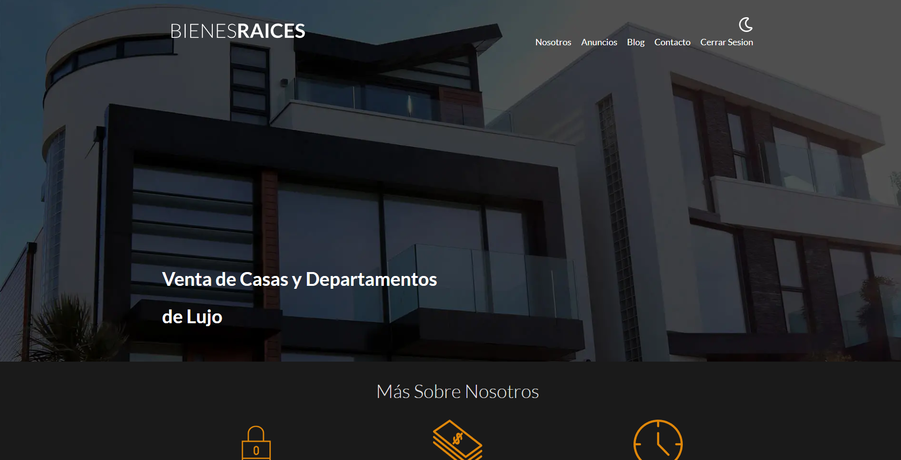

# Bienes Raices (OOP + Active Record + MVC Fullstack Project)

This project it's about a Real State agency, the administrators of the page can have full control of sellers and customers, allowing the CRUD operations, PHP was the mainly language used both for the frontend and backend.  
Working with Object Oriented Programming plus Active Record this project can improve and have scalability and finally with the MVC arquitecture pattern this leads to a great UI/UX experience. 

## Built With
 
 
 
 
 
 

## Overview
This project was made with technologies in the Frontend and Backend with a result of a FullStack project, Model View Controller arquitecture pattern was used, allowing sellers put any property in sale. CRUD is available with properties and sellers. Relational Database and Authentication are part of it aswell.

To start the project cd public -> localhost:3000