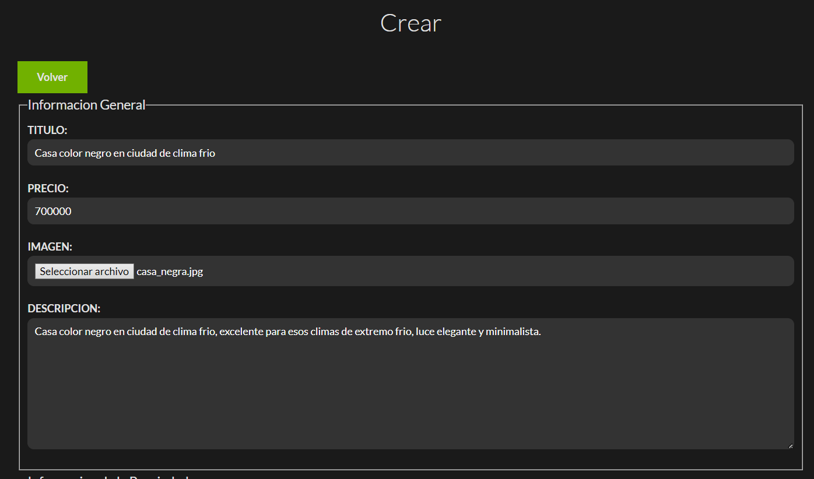

# Bienes Raices (OOP + Active Record + MVC Fullstack Project)

This project it's about a Real State agency, the administrators of the page can have full control of sellers and customers, allowing the CRUD operations, PHP was the mainly language used both for the frontend and backend.  
Working with Object Oriented Programming plus Active Record this project can improve and have scalability and finally with the MVC arquitecture pattern this leads to a great UI/UX experience. 

## Built With
 
 
 
 
 
 

## Overview
This project was made with technologies in the Frontend and Backend with a result of a FullStack project, Model View Controller arquitecture pattern was used, allowing sellers put any property in sale. CRUD is available with properties and sellers. Relational Database and Authentication are part of it aswell.

## Tables of MySQL
MySQL workbench was used to create the Model and ER Diagram, working aside with TablePlus to visualize the tables.

    

4 tables were needed, the property and sellers were the 2 most important, a relation of 1 to n was applied since a seller can have multiple properties, also a table of the users that the admin gave access to have an email and they were responsible of adding, updating and delete properties and sellers as they wish, finally the articles section from who we can pull all the info related to the blog. 

    

## Router for Public, Private and Auth Zone for each case scenarios
### Login
When a wrong email, password or unauthenticated user tries to login, secure validation and auth will appear.

    

    

If the given credentials or if the user is not verified it will throw an error.

Or if we want to access to the admin page inmmediately will be redirected to the main page.

### Admin Page
Here when the user logs in, at the very top he can create a property or a seller, next a little bit below he can see the properties and sellers that are available, each property have their own id, title, image, price and actions.  
As for the sellers id, name, phone number and actions. For both of them the actions are update the data and delete.

    

    

## CRUD
### Creating a Property/Seller Page
All the fields have validation in case something is missing.

    

    

    

### Lets create a new property

    

    

Now the new property will be listed in the admin page with the other properties.

    

A limit of the first 3 properties will be shown in the main page.

    

### Lets update a seller
Here we can see that the number lacks of more digits, it's a good chance to make an update.

    

    

    

### Lets delete the property created previously

    

As we can see, all the CRUD operations were part of this project.

## Form and php mailer 
In case a customer wants to sell or buy, he can fill in a form to make sure the Real State can contact him and speak about more details.

    

    

    

Now for testing the emails correctly i used mail trap

    

To start the project cd public -> localhost:3000